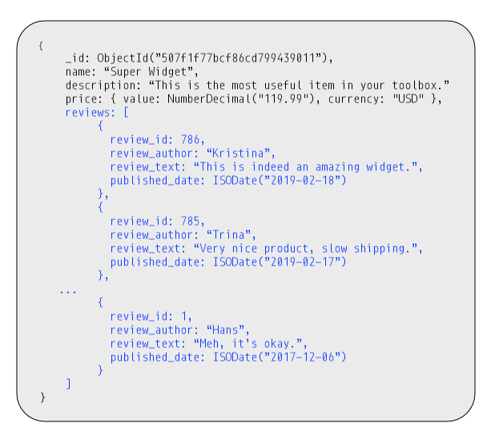
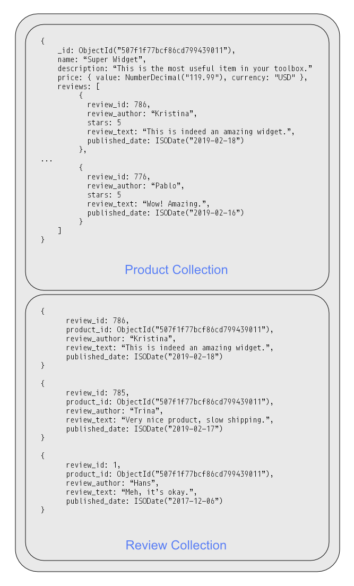
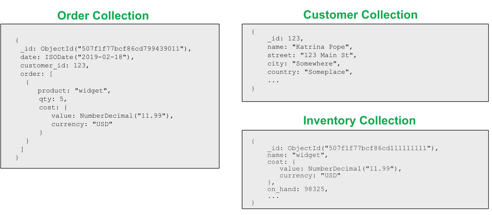
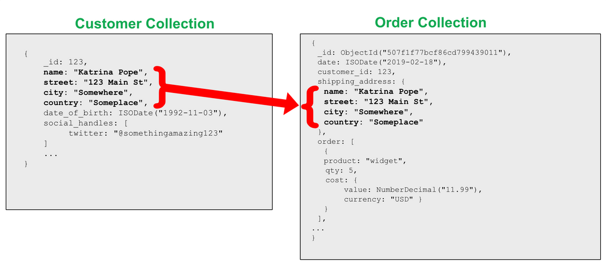
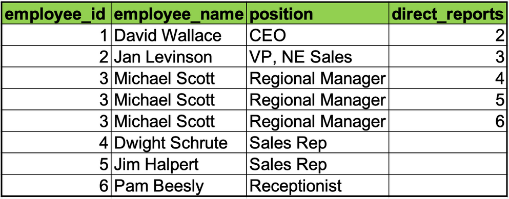
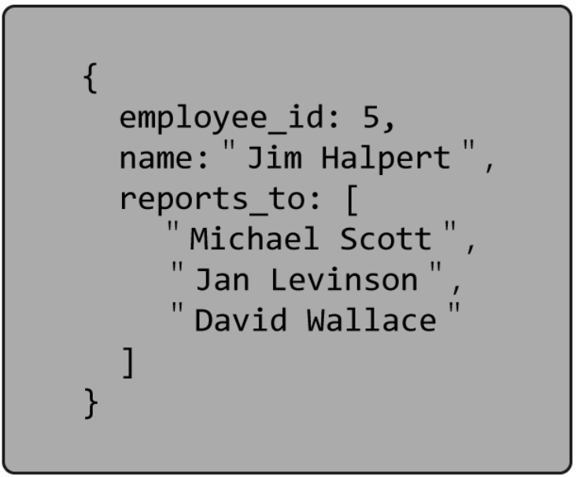
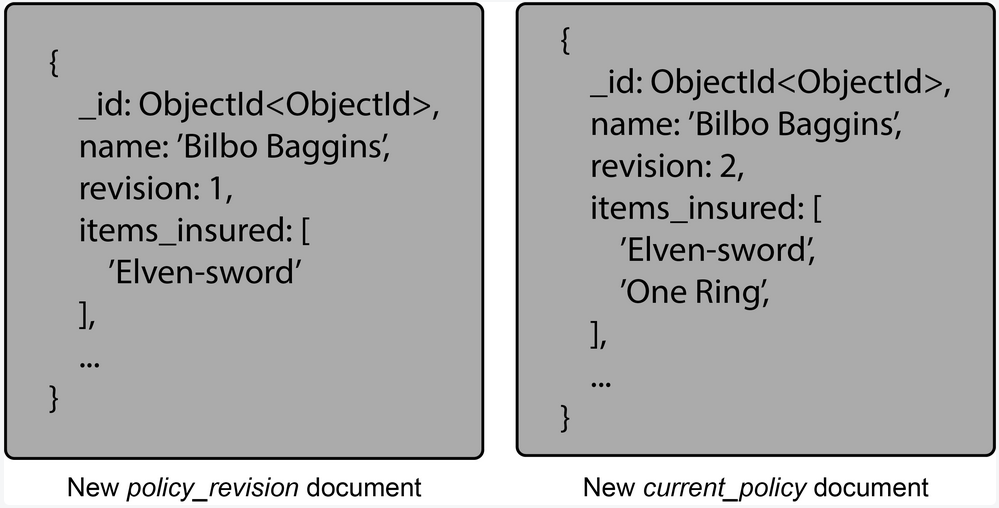

**The Polymorphic pattern**

The data stored about each comment does not need to be the same even though the documents are in the same collection.

_Why use:_

* Grouping documents together based on the queries we want to run (instead of separating the object across tables or
  collections) helps improve performance.

_When use:_

* We have queries to get all similar documents (all kind of comments)
* When all documents in a collection are of similar, but not identical.

_Sample use:_

* Products

---
**The Attribute Pattern**

Provides for easier indexing the documents, targeting many similar fields per document. By moving this subset of data
into a **key-value sub-document**, we can use non-deterministic field names, add additional qualifiers to the
information, and more clearly state the relationship of the original field and value. When we use the Attribute Pattern,
we need fewer indexes, our queries become simpler to write, and our queries become faster.

_Why use:_

* Easier indexing the documents, targeting many similar fields per document.

_When use:_

* We have big documents with many similar fields which means the same but in different units (bottle units) or describe
  the common characteristics (film release date)
* The fields we need to sort on are only found in a small subset of documents
* For user-defined fields, when searched by them are required

_Sample use:_
Products:  clothing, may have sizes that are expressed in small, medium, or large. Other products in the same collection
may be expressed in volume. Yet others may be expressed in physical dimensions or weight.

---
**The Bucket Pattern**

This pattern is particularly effective when working with Internet of Things (IoT), Real-Time Analytics, or Time-Series
data in general. By bucketing data together we make it easier to organize specific groups of data, increasing the
ability to discover historical trends or provide future forecasting and optimize our use of storage.

It's vital to find a compromise in **bucket size**. If we set size 50, then front can only query 50 measurements and
show client required measurements. The repository don't need to offer getting less than minimal bucket size.

_Why use:_

* reduce storage space
* index size savings,
* ability to use **pre-aggregated data** in our documents

_When use:_

* IoT, Real-Time Analytics, or Time-Series data in general

_Sample use:_

* Temperature measurements

---
**The Outlier Pattern**

Tailoring your schema for the typical document or query, application performance will be optimized for those normal use
cases and the outliers will still be addressed.

It's possible to store outliers' data in separate collection .

_Why use:_

* Preventing **a few** documents or queries to determine an application's solution. Especially when that solution would
  not **be optimal for the majority** of use cases.

_When use:_

* Aa few documents which have to be handled different

_Sample use:_

* Books, movies: handling IT books vs LOTR book

---
**The Computed Pattern**

Storing data which are computed repeatedly during read.

_When use:_

* Performing the same calculations repeatedly and you have a high read to write ratio

_Sample use:_

* All kind of data to create ordered lists like the "100 Best..."
* Datasets that need sums, such as revenue or viewers
* Time series data, event sourcing

---
**The Subset Pattern**

This pattern addresses the issues associated with a working set that exceeds RAM, resulting in information being removed
from memory. Use the advantages of the 1-N mapping and reduce the cost of getting subset.

_When use:_

* reduce the size of our working set

_Sample use:_

* e-commerce site that has a list of reviews for a product. In the Product collection, we'll only keep the ten most
  recent reviews. This allows the working set to be reduced by only bringing in a portion, or subset, of the overall
  data. The additional information, reviews in this example, are stored in a separate Reviews collection that can be
  accessed if the user wants to see additional reviews.

**Before**

**After**

---
**The Extended Reference Pattern**

The Extended Reference pattern is a wonderful solution when your application is experiencing many repetitive JOIN
operations.

There are times when having separate collections for data make sense. If an entity can be thought of as a separate "
thing", it often makes sense to have a separate collection. For example, in an e-commerce application, the idea of an
order exists, as does a customer, and inventory. They are separate logical entities.

From a performance standpoint, however, this becomes problematic as we need to put the pieces of information together
for a specific order.

1 customer <--> N orders   
N orders  <--> 1 customer

After moving shipping_address to order collection. We can query needed data without expensive lookup.

_When use:_

* reduce JOIN operation by copying some data to another collection. The copied data should be **immutable** (avoid
  multiple updates in more than one collection).

  When information is updated, we need to think about how to handle that as well. What extended references changed? When
  should those be updated?

_Sample use:_

* collections with join

---
**The Approximation Pattern**

We can use the Approximation Pattern when we need to display **calculations that are challenging/expensive** (
time, memory, CPU cycles) to calculate and for when **precision isn't of the highest priority**. Thanks to Gaussian
distribution precision can be calculated.

Precision tips:

* more frequent operation => more precision result
* more clients => less precision result

_When use:_

* Calculated value can be replaced by bigger one (multiple increasing value == one bigger increment)
* Precision isn't the highest priority
* The cost be to get an exact calculation of that number is high.

_Sample use:_

* Fluid data as city population, which exact number is not crucial as fast response

---
**The Tree Pattern**

The pattern allows replacing expensive multiple joins with hierarchical **static** **duplicated** data. Find performance
can be increased by adding an index on the _reports_to_ field.

_When use:_

* Data **should be static** and hierarchical.

Hierarchical data:

After applying the Tree Pattern:

_Sample use:_

* Identify the reporting chain from an employee to the CEO.

---
**The Document Versioning Pattern**

This pattern addresses the problem of **wanting to keep around older revisions** of some documents in MongoDB instead of
bringing in a second management system. To accomplish this, we add a field to each document allowing us to keep track of
the document version. The database will then have **two collections**: one that has the latest (most queried data) and
another that has all the revisions of the data.

_When use:_

* Each **document doesn’t have too many revisions** - ccess a different collectiondocumet 
* There **aren’t too many documents** to version.
* **Most** of the queries performed are done on the **most current version** of the document.

After applying The Document Versioning Pattern:

There are two documents:
* *..._revisio*n = historical data
* _current_..._ = current data

_Sample use:_
* Use cases required historical data